# Rich Text Editor Design Document

## Overview

This document outlines the design for a comprehensive rich text editor component built with Tiptap for the existing Next.js application with Supabase backend. The editor will follow the established FSR (Feature-Structured-Refactoring) pattern and integrate seamlessly with the existing glassmorphic theme system, providing a luxury workspace experience with advanced text editing capabilities, media handling, and specialized features for code, math, and research papers.

## Design Philosophy

### Visual Identity
- **Hidden Workspace Aesthetic**: Create a private, personal editing environment that feels like entering a premium, secure workspace
- **Glassmorphic Luxury**: Implement subtle glass effects with backdrop-filter: blur(12px) and rgba backgrounds for depth
- **Card-based Architecture**: Each editor component uses elevated card design with box-shadow: 0 8px 32px rgba(0, 0, 0, 0.1)
- **Micro-interactions**: All interactive elements respond within 100ms with smooth transitions
- **Typography Comfort**: Optimize for extended reading sessions with line-height: 1.7 and letter-spacing: 0.01em

### Theme Integration
The editor inherits from existing global.css theme variables and extends them for editor-specific use cases.

#### Dark Theme (Primary)
Based on existing global.css variables:
```css
/* Dark theme extends existing colors */
--editor-bg-primary: var(--ghost-dark); /* rgba(10, 10, 15, 0.95) */
--editor-bg-glass: rgba(20, 20, 30, 0.85);
--editor-surface: rgba(40, 40, 60, 0.6);
--editor-border: rgba(139, 92, 246, 0.2);
--editor-text-primary: var(--foreground); /* #ffffff */
--editor-accent: var(--ghost-purple); /* #8b5cf6 */
--editor-accent-glow: var(--ghost-neon); /* #00ff41 */
--editor-cyan-accent: var(--ghost-cyan); /* #00ffff */
```

#### Light Theme (Secondary)
Complementary light theme maintaining luxury feel:
```css
[data-theme="light"] {
--editor-bg-primary: rgba(250, 250, 255, 0.95);
--editor-bg-glass: rgba(255, 255, 255, 0.85);
--editor-surface: rgba(248, 248, 252, 0.8);
--editor-border: rgba(139, 92, 246, 0.15);
--editor-text-primary: #1a1a2e;
--editor-accent: #6d28d9;
--editor-accent-glow: #059669;
--editor-cyan-accent: #0891b2;
--editor-shadow-soft: 0 4px 20px rgba(139, 92, 246, 0.08);
--editor-shadow-elevated: 0 8px 32px rgba(139, 92, 246, 0.12);
}
```

## Architecture

### High-Level Architecture

```mermaid
graph TB
    A[Rich Text Editor Feature] --> B[Editor Components]
    A --> C[Extensions System]
    A --> D[Media Handler]
    A --> E[Theme Integration]
    A --> F[Performance Layer]
    
    B --> B1[RichTextEditor.tsx]
    B --> B2[EditorToolbar.tsx]
    B --> B3[EditorContent.tsx]
    B --> B4[EditorStatusBar.tsx]
    B --> B5[EditorFloatingMenu.tsx]
    
    C --> C1[Basic Extensions]
    C --> C2[Media Extensions]
    C --> C3[Code Extensions]
    C --> C4[Math Extensions]
    C --> C5[Citation Extensions]
    
    D --> D1[Image Upload ≤2s]
    D --> D2[File Validation <100ms]
    D --> D3[Supabase Storage]
    
    E --> E1[Theme Variables]
    E --> E2[Dynamic Styling <50ms]
    E --> E3[Responsive Design ≤768px]
    
    F --> F1[Lazy Loading]
    F --> F2[Virtual Scrolling >1000 nodes]
    F --> F3[Debounced Auto-save 500ms]
```



### FSR Structure

```
src/components/rich-text-editor/
├── RichTextEditor.tsx              # Main editor component (render ≤300ms)
├── index.ts                        # Feature exports
├── components/
│   ├── EditorToolbar.tsx          # Glassmorphic toolbar with backdrop-filter
│   ├── EditorContent.tsx          # Main editing area with virtual scrolling
│   ├── EditorStatusBar.tsx        # Real-time word count, character count
│   ├── EditorFloatingMenu.tsx     # Context-sensitive floating toolbar
│   ├── MediaUploader.tsx          # Drag-drop with visual feedback ≤200ms
│   ├── TableEditor.tsx            # Advanced table editing with cell selection
│   ├── LinkDialog.tsx             # Modal with auto URL validation
│   ├── ImageDialog.tsx            # Image editing with crop/resize tools
│   ├── CodeBlockEditor.tsx        # Syntax highlighting with 20+ languages
│   ├── MathEditor.tsx             # LaTeX editor with live preview ≤500ms
│   ├── CitationManager.tsx        # Academic citation with auto-formatting
│   └── index.ts                   # Component exports
├── extensions/
│   ├── basic/                     # Basic formatting (load time ≤50ms)
│   │   ├── bold.ts               # Bold formatting with Cmd+B
│   │   ├── italic.ts             # Italic formatting with Cmd+I
│   │   ├── underline.ts          # Underline with purple accent
│   │   └── index.ts
│   ├── media/                     # Media handling (chunked loading)
│   │   ├── image.ts              # Image with resize handles
│   │   ├── video.ts              # Video embed support
│   │   └── index.ts
│   ├── code/                      # Code extensions (async loading)
│   │   ├── code-block.ts         # Prism.js integration
│   │   ├── syntax-highlight.ts   # 20+ language support
│   │   └── index.ts
│   ├── math/                      # Math rendering (KaTeX ≤300ms)
│   │   ├── math-inline.ts        # Inline equations
│   │   ├── math-block.ts         # Block equations
│   │   └── index.ts
│   ├── research/                  # Academic features
│   │   ├── citation.ts           # Citation with mention system
│   │   ├── bibliography.ts       # Auto-generated bibliography
│   │   └── index.ts
│   └── index.ts                   # All extensions export
├── hooks/
│   ├── useEditor.ts               # Main editor hook with performance optimization
│   ├── useMediaUpload.ts          # Upload progress tracking
│   ├── useThemeEditor.ts          # Theme switching ≤100ms
│   ├── useAutoSave.ts             # Debounced save every 500ms
│   ├── useKeyboardShortcuts.ts    # 15+ keyboard shortcuts
│   └── index.ts                   # Hook exports
├── types/
│   ├── editor.ts                  # Editor-specific types
│   ├── media.ts                   # Media handling types
│   ├── extensions.ts              # Extension types
│   ├── theme.ts                   # Theme-specific types
│   └── index.ts                   # Type exports
├── utils/
│   ├── sanitizer.ts               # HTML sanitization (DOMPurify)
│   ├── file-validator.ts          # File validation ≤5MB, MIME checking
│   ├── content-parser.ts          # Content parsing utilities
│   ├── performance.ts             # Performance monitoring utilities
│   └── index.ts                   # Utility exports
└── styles/
    ├── editor.css                 # Core editor styling
    ├── toolbar.css                # Glassmorphic toolbar design
    ├── themes.css                 # Theme-specific overrides
    └── animations.css             # Micro-animations library
```

## Performance Requirements

### Rendering Performance
- **Initial Load**: Editor renders within 300ms on average hardware
- **Typing Response**: Keystroke to screen update ≤16ms (60fps)
- **Theme Switching**: Complete transition ≤100ms with no flicker
- **Large Documents**: Handle 10,000+ words with virtual scrolling
- **Image Processing**: Thumbnail generation ≤500ms for images up to 5MB

### Memory Management
- **Memory Usage**: Stay below 50MB heap usage for typical documents
- **Garbage Collection**: Minimize GC pauses to ≤5ms
- **Image Caching**: Implement LRU cache for 20 most recent images
- **Extension Loading**: Lazy load extensions to reduce initial bundle by 60%

## Components and Interfaces

### Core Components

#### 1. RichTextEditor (Main Component)

```typescript
interface RichTextEditorProps {
  content?: string;
  placeholder?: string;
  editable?: boolean;
  autoFocus?: boolean;
  className?: string;
  onUpdate?: (content: string, wordCount: number) => void;
  onSave?: (content: string) => Promise<void>;
  extensions?: Extension[];
  theme?: 'light' | 'dark' | 'auto';
  features?: EditorFeatures;
  performance?: PerformanceConfig;
  accessibility?: AccessibilityConfig;
}

interface EditorFeatures {
  basicFormatting: boolean;          // Bold, italic, underline
  advancedFormatting: boolean;       // Font family, size, color
  media: boolean;                    // Image/video upload
  tables: boolean;                   // Table creation/editing
  code: boolean;                     // Code blocks with syntax highlighting
  math: boolean;                     // LaTeX math rendering
  citations: boolean;                // Academic citations
  collaboration: boolean;            // Real-time collaboration
  focusMode: boolean;               // Distraction-free writing
  wordCount: boolean;               // Live word/character count
}

interface PerformanceConfig {
  virtualScrolling: boolean;         // For documents >1000 nodes
  lazyExtensions: boolean;          // Lazy load non-essential extensions
  autoSaveInterval: number;         // Auto-save interval in ms (default: 500)
  imageCompression: boolean;        // Compress images on upload
  maxDocumentSize: number;          // Max document size in characters
}
```

#### 2. EditorToolbar (Glassmorphic Design)

```typescript
interface EditorToolbarProps {
  editor: Editor;
  features: EditorFeatures;
  className?: string;
  position?: 'top' | 'bottom' | 'floating' | 'sticky';
  style?: 'glass' | 'solid' | 'minimal';
  responsive?: boolean;             // Collapse to hamburger on mobile
}

interface ToolbarGroup {
  name: string;
  items: ToolbarItem[];
  visible: boolean;
  priority: number;                 // For responsive hiding
  breakpoint?: 'sm' | 'md' | 'lg'; // When to show/hide
}

interface ToolbarItem {
  name: string;
  icon: React.ComponentType;
  action: () => void;
  isActive: boolean;
  isDisabled: boolean;
  tooltip: string;
  shortcut?: string;               // Display keyboard shortcut
  variant?: 'primary' | 'secondary' | 'accent';
}
```

#### 3. MediaUploader (Advanced Upload System)

```typescript
interface MediaUploaderProps {
  onUpload: (files: File[]) => Promise<MediaUploadResult[]>;
  acceptedTypes: string[];          // ['image/jpeg', 'image/png', 'image/gif']
  maxFileSize: number;              // 5MB default
  maxFiles: number;                 // 10 files per batch
  className?: string;
  uploadProgress?: (progress: number) => void;
  compressionQuality?: number;      // 0.8 default for images
}

interface MediaUploadResult {
  id: string;
  url: string;
  filename: string;
  size: number;
  type: string;
  dimensions?: { width: number; height: number };
  thumbnail?: string;               // Automatically generated thumbnail
  uploadTime: number;               // Upload duration in ms
  error?: string;
}
```

### Advanced UI Components

#### 4. ImageEditor (Built-in Image Editing)

```typescript
interface ImageEditorProps {
  src: string;
  alt?: string;
  onSave: (editedImage: EditedImageData) => void;
  onCancel: () => void;
  tools: ImageEditingTool[];
}

interface ImageEditingTool {
  name: 'crop' | 'resize' | 'rotate' | 'filter' | 'brightness' | 'contrast';
  enabled: boolean;
  config?: any;
}

interface EditedImageData {
  src: string;                      // Base64 or URL
  alt: string;
  width: number;
  height: number;
  alignment: 'left' | 'center' | 'right' | 'inline';
  caption?: string;
  compressionRatio: number;
}
```

#### 5. CodeBlockEditor (Advanced Code Features)

```typescript
interface CodeBlockEditorProps {
  language: string;
  code: string;
  onUpdate: (code: string, language: string) => void;
  theme: 'vs-dark' | 'vs-light' | 'github-dark' | 'dracula';
  features: CodeFeatures;
}

interface CodeFeatures {
  lineNumbers: boolean;             // Show line numbers
  wordWrap: boolean;               // Word wrap long lines
  minimap: boolean;                // Show code minimap
  autocomplete: boolean;           // Basic autocomplete
  syntaxHighlight: boolean;        // Syntax highlighting
  copyButton: boolean;             // Copy to clipboard button
  languageSelector: boolean;       // Language dropdown
}
```

## Data Models

### Editor Content Model (Enhanced)

```typescript
interface EditorContent {
  id: string;
  type: 'doc';
  content: EditorNode[];
  metadata: ContentMetadata;
  performance: PerformanceMetrics;
}

interface ContentMetadata {
  wordCount: number;
  characterCount: number;
  readingTime: number;              // Calculated at 200 words/minute
  lastModified: Date;
  version: number;
  author?: string;
  language?: string;                // For spell checking
  tags?: string[];                  // Content categorization
}

interface PerformanceMetrics {
  renderTime: number;               // Last render time in ms
  nodeCount: number;                // Total number of nodes
  imageCount: number;               // Number of images
  codeBlockCount: number;           // Number of code blocks
  lastSaveTime: number;             // Last save duration
}
```

### Theme Configuration Model

```typescript
interface EditorTheme {
  name: string;
  mode: 'light' | 'dark';
  colors: ThemeColors;
  typography: ThemeTypography;
  effects: ThemeEffects;
  animations: ThemeAnimations;
}

interface ThemeColors {
  background: {
    primary: string;                // Main editor background
    glass: string;                  // Glassmorphic overlay
    surface: string;                // Card surfaces
    hover: string;                  // Hover states
  };
  text: {
    primary: string;                // Main text color
    secondary: string;              // Secondary text
    muted: string;                  // Placeholder text
    accent: string;                 // Accent text
  };
  accent: {
    purple: string;                 // Primary accent (purple)
    neon: string;                   // Success/active states (neon green)
    cyan: string;                   // Information states (cyan)
    error: string;                  // Error states
    warning: string;                // Warning states
  };
  border: {
    primary: string;                // Default borders
    focus: string;                  // Focus states
    active: string;                 // Active elements
  };
}

interface ThemeTypography {
  fontFamily: {
    sans: string;                   // Main UI font
    serif: string;                  // Reading font
    mono: string;                   // Code font
  };
  fontSize: {
    xs: string;                     // 12px
    sm: string;                     // 14px
    base: string;                   // 16px
    lg: string;                     // 18px
    xl: string;                     // 20px
    '2xl': string;                  // 24px
  };
  lineHeight: {
    tight: number;                  // 1.25
    normal: number;                 // 1.5
    relaxed: number;                // 1.7
    loose: number;                  // 2.0
  };
  letterSpacing: {
    tight: string;                  // -0.025em
    normal: string;                 // 0em
    wide: string;                   // 0.025em
  };
}

interface ThemeEffects {
  glassmorphism: {
    backdrop: string;               // backdrop-filter: blur(12px)
    background: string;             // rgba with transparency
    border: string;                 // Border with transparency
  };
  shadows: {
    soft: string;                   // Subtle shadow
    medium: string;                 // Card shadow
    elevated: string;               // Modal/dropdown shadow
    glow: string;                   // Accent glow effect
  };
  borderRadius: {
    sm: string;                     // 4px
    md: string;                     // 8px
    lg: string;                     // 12px
    xl: string;                     // 16px
  };
}

interface ThemeAnimations {
  durations: {
    fast: string;                   // 150ms
    normal: string;                 // 300ms
    slow: string;                   // 500ms
  };
  easings: {
    ease: string;                   // ease-in-out
    bounce: string;                 // spring animation
    smooth: string;                 // smooth transition
  };
}
```

## Error Handling (Specific Implementation)

### Error Types with Specific Messages

```typescript
enum EditorErrorType {
  UPLOAD_FAILED = 'upload_failed',
  FILE_TOO_LARGE = 'file_too_large',
  INVALID_FILE_TYPE = 'invalid_file_type',
  NETWORK_ERROR = 'network_error',
  PERMISSION_DENIED = 'permission_denied',
  CONTENT_VALIDATION_ERROR = 'content_validation_error',
  EXTENSION_ERROR = 'extension_error',
  PERFORMANCE_DEGRADED = 'performance_degraded',
  STORAGE_QUOTA_EXCEEDED = 'storage_quota_exceeded'
}

interface EditorError {
  type: EditorErrorType;
  message: string;
  details?: any;
  timestamp: Date;
  action?: ErrorAction;             // Suggested user action
  recoverable: boolean;             // Can user retry?
}

interface ErrorAction {
  label: string;                    // "Retry Upload", "Reduce File Size"
  action: () => void;              // Action to perform
  shortcut?: string;               // Keyboard shortcut
}
```

### Error Messages (User-Friendly)

```typescript
const ERROR_MESSAGES = {
  [EditorErrorType.FILE_TOO_LARGE]: (maxSize: number) => 
    `File exceeds ${maxSize}MB limit. Please compress or choose a smaller file.`,
  [EditorErrorType.INVALID_FILE_TYPE]: (allowedTypes: string[]) =>
    `File type not supported. Please use: ${allowedTypes.join(', ')}`,
  [EditorErrorType.NETWORK_ERROR]: () =>
    `Upload failed due to network issues. Check your connection and retry.`,
  [EditorErrorType.STORAGE_QUOTA_EXCEEDED]: (used: number, limit: number) =>
    `Storage limit reached (${used}/${limit}MB). Upgrade or delete files to continue.`,
  [EditorErrorType.PERFORMANCE_DEGRADED]: () =>
    `Document is large and may respond slowly. Consider splitting into smaller sections.`
};
```

## Testing Strategy (Measurable Criteria)

### Performance Testing

```typescript
describe('Editor Performance', () => {
  test('renders within 300ms for documents up to 5000 words', async () => {
    const startTime = performance.now();
    render(<RichTextEditor content={generateContent(5000)} />);
    await waitForElementToBeVisible();
    const renderTime = performance.now() - startTime;
    expect(renderTime).toBeLessThan(300);
  });

  test('maintains 60fps during typing with 1000+ nodes', async () => {
    const editor = render(<RichTextEditor />);
    const frameRate = await measureFrameRate(() => {
      // Simulate rapid typing
      typeText('Lorem ipsum '.repeat(200));
    });
    expect(frameRate).toBeGreaterThan(58); // Allow for 2fps margin
  });

  test('theme switching completes within 100ms', async () => {
    const { switchTheme } = render(<RichTextEditor />);
    const switchTime = await measureTime(() => switchTheme('dark'));
    expect(switchTime).toBeLessThan(100);
  });
});
```

### User Experience Testing

```typescript
describe('User Experience', () => {
  test('new users complete basic formatting within 30 seconds', async () => {
    const startTime = Date.now();
    const user = userEvent.setup();
    
    // Simulate new user workflow
    await user.type(screen.getByRole('textbox'), 'Hello world');
    await user.click(screen.getByRole('button', { name: /bold/i }));
    await user.click(screen.getByRole('button', { name: /save/i }));
    
    const completionTime = Date.now() - startTime;
    expect(completionTime).toBeLessThan(30000);
  });

  test('image upload provides feedback within 200ms', async () => {
    const file = new File(['image'], 'test.jpg', { type: 'image/jpeg' });
    const startTime = performance.now();
    
    await uploadFile(file);
    await waitFor(() => screen.getByText(/uploading/i));
    
    const feedbackTime = performance.now() - startTime;
    expect(feedbackTime).toBeLessThan(200);
  });
});
```

### Accessibility Testing

```typescript
describe('Accessibility', () => {
  test('keyboard navigation reaches all tools within 10 tab stops', async () => {
    render(<RichTextEditor />);
    const tabStops = await countTabStops();
    expect(tabStops).toBeLessThanOrEqual(10);
  });

  test('screen reader announces formatting changes within 1 second', async () => {
    const announcements = [];
    mockScreenReader((text) => announcements.push(text));
    
    await applyBoldFormatting();
    await waitFor(() => expect(announcements).toContain('Bold applied'), {
      timeout: 1000
    });
  });
});
```

## Security Implementation (Specific Rules)

### Content Sanitization Rules

```typescript
const SANITIZATION_CONFIG: SanitizationConfig = {
  allowedTags: [
    'p', 'br', 'strong', 'em', 'u', 's', 'sup', 'sub',
    'h1', 'h2', 'h3', 'h4', 'h5', 'h6',
    'ul', 'ol', 'li',
    'a', 'img', 'figure', 'figcaption',
    'table', 'tr', 'td', 'th', 'thead', 'tbody',
    'code', 'pre',
    'blockquote',
    'span', 'div'
  ],
  allowedAttributes: {
    'a': ['href', 'title', 'target', 'rel'],
    'img': ['src', 'alt', 'width', 'height', 'data-*'],
    'code': ['class', 'data-language'],
    'pre': ['class', 'data-language'],
    'span': ['class', 'style', 'data-*'],
    'div': ['class', 'data-*'],
    '*': ['id', 'class']
  },
  allowedSchemes: ['http', 'https', 'mailto', 'data'],
  forbiddenTags: ['script', 'style', 'iframe', 'object', 'embed', 'form', 'input'],
  stripComments: true,
  stripScripts: true,
  maxNesting: 10,                   // Prevent deeply nested structures
  maxAttributes: 15                 // Limit attributes per element
};
```

### File Upload Security

```typescript
interface FileSecurityConfig {
  maxFileSize: 5 * 1024 * 1024;    // 5MB
  allowedMimeTypes: [
    'image/jpeg',
    'image/png', 
    'image/gif',
    'image/webp'
  ];
  virusScan: boolean;               // Enable virus scanning
  metadataStripping: boolean;       // Remove EXIF data
  dimensionLimits: {
    maxWidth: 4000,
    maxHeight: 4000,
    minWidth: 10,
    minHeight: 10
  };
  rateLimits: {
    uploadsPerMinute: 10,
    uploadsPerHour: 100,
    totalStoragePerUser: 1024 * 1024 * 1024 // 1GB
  };
}
```

## Integration Points (Detailed Implementation)

### Supabase Integration with Error Recovery

```typescript
class SupabaseMediaHandler {
  private readonly retryAttempts = 3;
  private readonly retryDelay = 1000;

  async uploadFile(file: File): Promise<MediaUploadResult> {
    let lastError: Error;
    
    for (let attempt = 1; attempt <= this.retryAttempts; attempt++) {
      try {
        const result = await this.attemptUpload(file);
        return result;
      } catch (error) {
        lastError = error;
        if (attempt < this.retryAttempts) {
          await this.delay(this.retryDelay * attempt);
        }
      }
    }
    
    throw new EditorError({
      type: EditorErrorType.UPLOAD_FAILED,
      message: `Upload failed after ${this.retryAttempts} attempts`,
      details: lastError,
      timestamp: new Date(),
      recoverable: true,
      action: {
        label: 'Retry Upload',
        action: () => this.uploadFile(file),
        shortcut: 'Cmd+R'
      }
    });
  }

  private async attemptUpload(file: File): Promise<MediaUploadResult> {
    const fileName = `editor/${Date.now()}-${crypto.randomUUID()}-${file.name}`;
    const startTime = performance.now();
    
    const { data, error } = await supabase.storage
      .from('editor-media')
      .upload(fileName, file, {
        cacheControl: '3600',
        upsert: false
      });
    
    if (error) throw error;
    
    const { data: { publicUrl } } = supabase.storage
      .from('editor-media')
      .getPublicUrl(fileName);
    
    const uploadTime = performance.now() - startTime;
    
    return {
      id: crypto.randomUUID(),
      url: publicUrl,
      filename: file.name,
      size: file.size,
      type: file.type,
      uploadTime,
      thumbnail: await this.generateThumbnail(file)
    };
  }
}
```

### Theme System Integration

```typescript
const EDITOR_THEME_EXTENSION = {
  // Extend existing global.css variables for editor
  ':root': {
    '--editor-glass-bg': 'rgba(20, 20, 30, 0.85)',
    '--editor-glass-border': 'rgba(139, 92, 246, 0.2)',
    '--editor-shadow-luxury': '0 8px 32px rgba(0, 0, 0, 0.12), 0 2px 8px rgba(139, 92, 246, 0.08)',
    '--editor-animation-smooth': 'all 0.3s cubic-bezier(0.4, 0.0, 0.2, 1)',
    '--editor-backdrop-blur': 'blur(12px)',
    '--editor-font-reading': '-apple-system, BlinkMacSystemFont, "Segoe UI", Roboto, "Helvetica Neue", Arial, sans-serif',
    '--editor-line-height-comfortable': '1.7',
    '--editor-letter-spacing-reading': '0.01em'
  },
  
  '[data-theme="light"]': {
    '--editor-glass-bg': 'rgba(255, 255, 255, 0.85)',
    '--editor-glass-border': 'rgba(139, 92, 246, 0.15)',
    '--editor-shadow-luxury': '0 8px 32px rgba(139, 92, 246, 0.06), 0 2px 8px rgba(0, 0, 0, 0.04)',
    '--editor-text-primary': '#1a1a2e',
    '--editor-accent': '#6d28d9',
    '--editor-surface': 'rgba(248, 248, 252, 0.9)'
  }
};
```