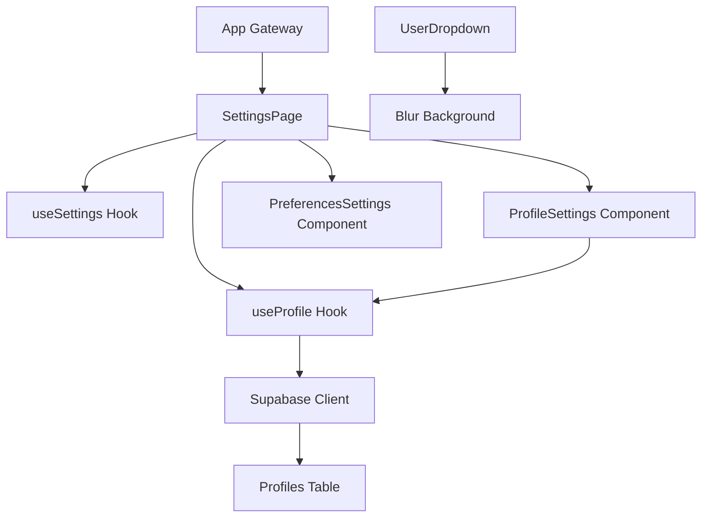

# Design Document

## Overview

The Settings Profile Management feature will be restructured to follow the FSR (Feature-Specific Routing) pattern while fixing Supabase integration issues and enhancing the user experience. The design focuses on proper separation of concerns, type safety, and seamless data persistence with the Supabase profiles table.

## Architecture

### FSR Structure Implementation

```
src/
├── app/
│   └── settings/
│       └── page.tsx                 # Gateway component (minimal)
└── components/
    └── settings/
        ├── index.ts                 # Barrel exports
        ├── pages/
        │   └── SettingsPage.tsx     # Main settings page logic
        ├── components/
        │   ├── ProfileSettings.tsx  # Profile management component
        │   └── PreferencesSettings.tsx # Future preferences component
        ├── hooks/
        │   ├── useProfile.ts        # Profile data management
        │   └── useSettings.ts       # General settings logic
        └── types/
            └── index.ts             # Type definitions
```

### Data Flow Architecture



## Components and Interfaces

### App Gateway Component

**File:** `src/app/settings/page.tsx`

```typescript
// Minimal gateway that imports and renders the main settings page
import { SettingsPage } from '@/components/settings';

export default function Settings() {
  return <SettingsPage />;
}
```

**Purpose:** Acts as a simple gateway following Next.js app router conventions while delegating all logic to the FSR structure.

### Main Settings Page Component

**File:** `src/components/settings/pages/SettingsPage.tsx`

**Key Features:**
- Authentication checking and redirection
- Loading state management
- Layout and navigation (back button)
- Integration of ProfileSettings and PreferencesSettings components

**Dependencies:**
- `useSettings` hook for general settings logic
- `useProfile` hook for profile data management
- UI components for layout and navigation

### Profile Settings Component

**File:** `src/components/settings/components/ProfileSettings.tsx`

**Enhanced Features:**
- Form state management with real-time updates
- Input validation and character limits
- Save operation with loading states
- Account information display (member since, last updated)
- Proper error handling and user feedback

### User Dropdown Enhancement

**File:** `src/components/navbar/components/UserDropdown.tsx`

**Blur Background Implementation:**
```typescript
// Enhanced dropdown with backdrop blur
<div className="absolute right-0 top-full mt-2 w-64 bg-card/80 backdrop-blur-md border border-border rounded-lg shadow-lg z-50 overflow-hidden animate-in fade-in-0 zoom-in-95">
```

## Data Models

### Profile Interface

```typescript
export interface Profile {
  id: string;                    // UUID from auth.users
  username: string | null;       // User's display name
  bio: string | null;           // User biography (max 500 chars)
  avatar_url: string | null;    // Profile picture URL
  created_at: string;           // ISO timestamp
  updated_at: string;           // ISO timestamp
}
```

### Settings Form Data

```typescript
export interface SettingsFormData {
  username: string;             // Required for form submission
  bio: string;                 // Required for form submission
}
```

### Supabase Integration

**Environment Configuration:**
- `NEXT_PUBLIC_SUPABASE_URL`: https://jhdkfbpmxiqjrzkwhabb.supabase.co
- `NEXT_PUBLIC_SUPABASE_ANON_KEY`: sb_publishable_Tmb2fBLn4pMPYKIqtQ-5DQ_8znF4ruz

**Client Configuration:**
```typescript
// Use existing lib/supabase.ts configuration
import { getSupabaseClient } from '@/lib/supabase';
```

**Database Operations:**
- **Fetch Profile:** `SELECT * FROM profiles WHERE id = user.id`
- **Update Profile:** `UPDATE profiles SET username, bio, updated_at WHERE id = user.id`

## Error Handling

### Profile Data Fetching

1. **Authentication Errors:** Redirect to login or show authentication prompt
2. **Network Errors:** Display retry mechanism with error toast
3. **Data Not Found:** Handle gracefully with empty state
4. **Permission Errors:** Show appropriate access denied message

### Profile Saving

1. **Validation Errors:** Show field-specific error messages
2. **Network Failures:** Retry mechanism with exponential backoff
3. **Supabase Errors:** Parse and display user-friendly error messages
4. **Success States:** Show confirmation toast and update local state

### TypeScript Error Resolution

1. **Import Path Fixes:** Update all imports to use correct paths (`@/lib/supabase`)
2. **Hook Dependencies:** Add proper dependency arrays to useEffect hooks
3. **Unused Variables:** Remove or utilize all declared variables
4. **Type Safety:** Ensure all components have proper TypeScript interfaces

## Testing Strategy

### Unit Testing

1. **useProfile Hook Testing:**
   - Test profile fetching with different user states
   - Test save operations with success/failure scenarios
   - Test loading and error states

2. **Component Testing:**
   - ProfileSettings form interactions
   - Input validation and character limits
   - Save button states and feedback

3. **Integration Testing:**
   - End-to-end profile update flow
   - Authentication state changes
   - Supabase client integration

### Manual Testing Scenarios

1. **Profile Management Flow:**
   - Load settings page as authenticated user
   - Edit username and bio fields
   - Save changes and verify persistence
   - Check account information display

2. **Error Scenarios:**
   - Network disconnection during save
   - Invalid authentication state
   - Supabase service unavailability

3. **UI/UX Testing:**
   - UserDropdown blur background visibility
   - Responsive design on mobile devices
   - Loading states and transitions

## Performance Considerations

### Optimization Strategies

1. **Lazy Loading:** Settings page components loaded on demand
2. **Memoization:** Profile data cached to prevent unnecessary re-fetches
3. **Debounced Saves:** Prevent rapid-fire save operations
4. **Optimistic Updates:** Update UI immediately while saving in background

### Bundle Size Impact

- Minimal impact due to FSR structure keeping components modular
- Supabase client already included in existing bundle
- UI components reused from existing design system

## Security Considerations

### Data Protection

1. **Row Level Security:** Leverage existing Supabase RLS policies
2. **Input Sanitization:** Validate and sanitize all user inputs
3. **Authentication Checks:** Verify user authentication before data operations
4. **CSRF Protection:** Use Supabase's built-in CSRF protection

### Privacy

1. **Profile Visibility:** Respect user privacy settings for profile information
2. **Data Retention:** Follow data retention policies for profile updates
3. **Audit Trail:** Log profile changes for security monitoring