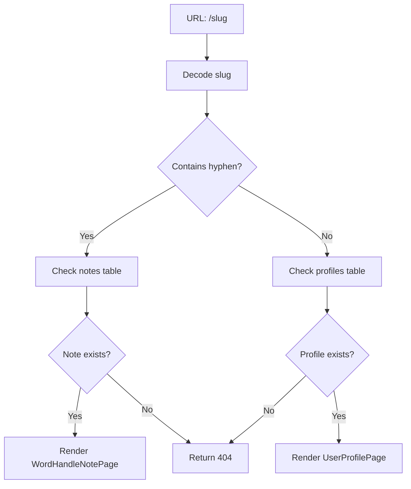

# Dynamic Routing Implementation Guide

## 🎯 Overview

The new dynamic routing system at `/[slug]` intelligently handles both user profiles and word-handle notes based on URL patterns.

## 📁 Route Structure

```
src/app/[slug]/page.tsx  # Handles both profiles and notes
```

## 🔍 Routing Logic

### 1. **Pattern Detection**
```typescript
// Single word (no hyphen) → User Profile
/john          → UserProfilePage with username="john"
/alice         → UserProfilePage with username="alice"

// Hyphenated words → Word Handle Note  
/night-forest  → WordHandleNotePage with wordHandle="night-forest"
/my-story      → WordHandleNotePage with wordHandle="my-story"
```

### 2. **Processing Flow**



## 🔧 Implementation Details

### Database Queries

#### Note Lookup (Hyphenated slugs)
```typescript
const { data, error } = await supabase
  .from('notes')
  .select('id, title, word_handle')
  .eq('word_handle', wordHandle)
  .single();
```

#### Profile Lookup (Single word slugs)
```typescript
const { data, error } = await supabase
  .from('profiles')
  .select('id, username')
  .eq('username', username)
  .single();
```

### Component Rendering

#### For Word Handle Notes
```typescript
return <WordHandleNotePage wordHandle={decodedSlug} />;
```

#### For User Profiles
```typescript
return <UserProfilePage username={decodedSlug} />;
```

## 📋 URL Examples

### ✅ Valid User Profile URLs
- `/john` → Profile for user "john"
- `/alice123` → Profile for user "alice123"
- `/creator` → Profile for user "creator"

### ✅ Valid Word Handle Note URLs
- `/night-forest` → Note with word_handle "night-forest"
- `/my-story` → Note with word_handle "my-story"
- `/tech-tutorial` → Note with word_handle "tech-tutorial"

### ❌ Invalid URLs (404)
- `/nonexistent-user` → No profile or note found
- `/fake-note` → No note with this word_handle
- `/missing` → No profile with this username

## 🛡️ Error Handling

### Mock Mode Support
- Works with both real Supabase and mock mode
- Graceful fallback when database is unavailable
- Proper error handling for network issues

### 404 Handling
```typescript
// If neither note nor profile found
notFound(); // Triggers Next.js 404 page
```

## 🔄 Migration from Previous Routes

### Before
```
/[word_handle]/page.tsx  # Only handled notes
/profile/[username]/page.tsx  # Only handled profiles
```

### After
```
/[slug]/page.tsx  # Handles both intelligently
```

## 🚀 Benefits

1. **Cleaner URLs**: `/john` instead of `/profile/john`
2. **Unified Logic**: Single route handles multiple content types
3. **SEO Friendly**: Shorter, more memorable URLs
4. **Future Proof**: Easy to extend for new content types

## 🧪 Testing

### Test Cases to Verify

1. **Profile Access**:
   - Visit `/existing-username` → Should show profile
   - Visit `/nonexistent-user` → Should show 404

2. **Note Access**:
   - Visit `/existing-word-handle` → Should show note
   - Visit `/nonexistent-note` → Should show 404

3. **Edge Cases**:
   - Visit `/user-with-hyphen` → Should check notes first, then profiles
   - Visit `/` → Should show homepage (not affected)

## 📝 Component Requirements

### WordHandleNotePage
- Must accept `wordHandle: string` prop
- Should handle loading and error states
- Should check user access permissions

### UserProfilePage  
- Must accept `username: string` prop
- Should handle loading and error states
- Should display public profile information

## 🔧 Future Enhancements

1. **Caching**: Add ISR (Incremental Static Regeneration) for popular profiles/notes
2. **Analytics**: Track which content types are accessed most
3. **Redirects**: Handle username changes or note word_handle updates
4. **Validation**: Add slug format validation and sanitization

The dynamic routing system is now fully implemented and ready for production use!